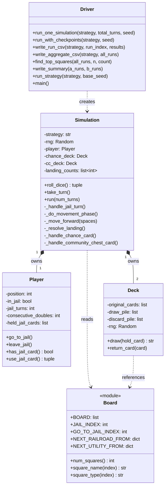

```mermaid
classDiagram
    class Player {
        -position: int
        -in_jail: bool
        -jail_turns: int
        -consecutive_doubles: int
        -held_jail_cards: list
        +go_to_jail()
        +leave_jail()
        +has_jail_card() bool
        +use_jail_card() tuple
    }

    class Deck {
        -original_cards: list
        -draw_pile: list
        -discard_pile: list
        -rng: Random
        +draw(hold_card) str
        +return_card(card)
    }

    class Simulation {
        -strategy: str
        -rng: Random
        -player: Player
        -chance_deck: Deck
        -cc_deck: Deck
        -landing_counts: list~int~
        +roll_dice() tuple
        +take_turn()
        +run(num_turns)
        -_handle_jail_turn()
        -_do_movement_phase()
        -_move_forward(spaces)
        -_resolve_landing()
        -_handle_chance_card()
        -_handle_community_chest_card()
    }

    class Driver {
        +run_one_simulation(strategy, total_turns, seed)
        +run_with_checkpoints(strategy, seed)
        +write_run_csv(strategy, run_index, results)
        +write_aggregate_csv(strategy, all_runs)
        +find_top_squares(all_runs, n, count)
        +write_summary(a_runs, b_runs)
        +run_strategy(strategy, base_seed)
        +main()
    }

    class Board {
        <<module>>
        +BOARD: list
        +num_squares() int
        +square_name(index) str
        +square_type(index) str
        +JAIL_INDEX: int
        +GO_TO_JAIL_INDEX: int
        +NEXT_RAILROAD_FROM: dict
        +NEXT_UTILITY_FROM: dict
    }

    Simulation "1" *-- "1" Player : owns
    Simulation "1" *-- "2" Deck : owns
    Driver ..> Simulation : creates
    Simulation ..> Board : reads
    Deck ..> Board : references
```
